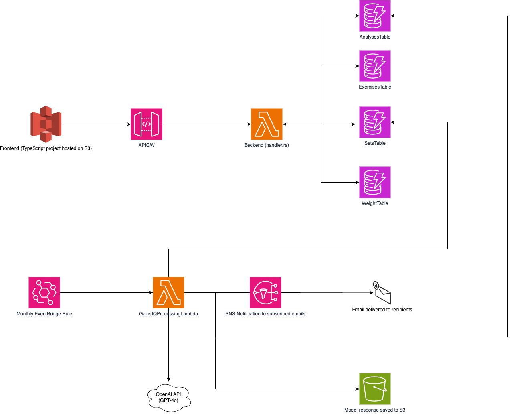

# GainsIQ

## What is this?
A simple web-based workout tracker. You can instantly generate an analysis of your workouts with integrated LLM support.

## Deploying 
Before you can do `cdk deploy`, you must do a few things:
 - Install aforementend dependencies, and also the python dependencies (in requirements.txt). I'd recommend using a virtual environement for all this.
 - Create a config.json file in the top-level directory. This is used by the CDK stack. It needs the following format: 
```
{
    "email": "YOUR EMAIL",
    "openai_key": "YOUR OPENAI API KEY"
    "oura_key": "YOUR OURA PERSONAL ACCESS TOKEN HERE" <-- Unused for now, will change
}
```
- Next, build the backend. `GOOS=linux GOARCH=amd64 go build -ldflags="-s -w" -o bootstrap main.go` will do this for you.
- Next, build the frontend. This can be done via `npm run build`. 

After this, you can deploy. Note that the site won't be connected to your backend yet. This is because you'll need the API URL (you can get this from API Gateway) for the frontend. Create a .env file in the frontend directory like the following:
```
REACT_APP_API_URL=https://blahblahblah.execute-api.us-west-2.amazonaws.com/prod
```
Rebuild the frontend again and then deploy.

Note there's a script `build_and_deploy_prod.sh` that will do most of this for you. You'll still have to double-deploy; 
just run the script again after fetching the app url.

Note that there's an SDK to handle API calls to the backend, which can be found here: https://github.com/robbiehammond/gainsiq-sdk <-- deprecated.

## iOS App
The current frontend is being deprecated in favor of an iOS app: https://github.com/robbiehammond/GainsIQMobile

## Design
Just so I remember vaguely how this works:


A note: You can deploy a preprod and a prod version. Here's how that kinda works:
- build_and_deploy.sh will deploy stuff with "preprod" attached to the end. This can be used as the playground to test stuff
- The regular build_and_deploy_prod.sh script won't append preprod to everything. 
