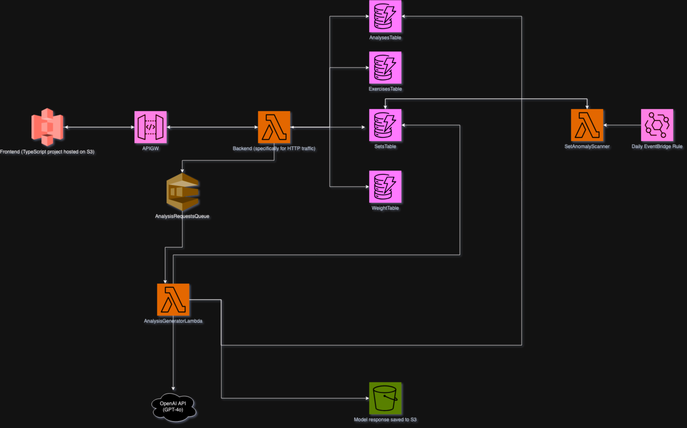

# GainsIQ

## What is this?
A simple web-based workout tracker. You'll get sent a monthly email summary of your progress, analyzed by an LLM.

## Deploying 
Before you can do `cdk deploy`, you must do a few things:
 - Create a config.json file in the top-level directory. This is used by the CDK stack. It needs the following format: 
```
{
    "email": "YOUR EMAIL",
    "openai_key": "YOUR OPENAI API KEY"
}
```
- Next, build the backend. `cargo lambda build --release --arm64` will do this for you.
- Next, build the frontend. This can be done via `npm run build`. 

After this, you can deploy. Note that the site won't be connected to your backend yet. This is because you'll need to the API URL (you can get this from API Gateway) for the frontend. Create a .env file in the frontend directory like the following:
```
REACT_APP_API_URL=https://blahblahblah.execute-api.us-west-2.amazonaws.com/prod
```
Rebuild the frontend again and then deploy.


## Design
Just so I remember vaguely how this works:



## Task Backlog (vaguely ordered in terms of importance)
- Redesign frontend so it doesn't look so bad
- An image that illustrates the design 
- Rename "sets" column to "set_number" or "setNumber"
- Make it so double deploy doesn't need to happen first time (pass APIGW URL to frontend one deploy)